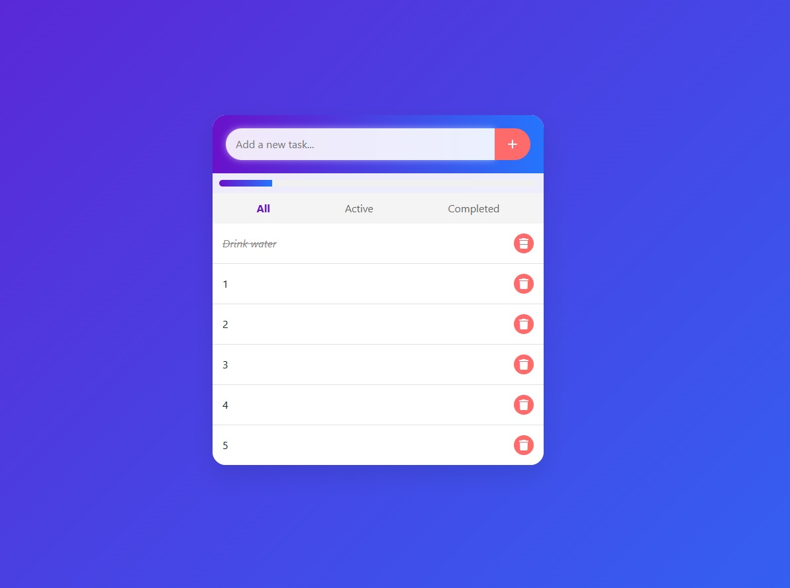

# Todo List Application

## Overview
An interactive, responsive Todo List web application built with HTML, CSS, and JavaScript.

## Features
- 🚀 Add, delete, and mark tasks
- 📊 Track task progress 
- 🔍 Filter tasks
- 💾 Save tasks

## Technologies Used
- HTML5
- CSS3
- JavaScript
- Bootstrap
- Font Awesome

## How to Run
1. Clone the project to your computer
2. Open `index.html` in your browser

## Screenshots

## Contributing
1. Fork it
2. Create your feature branch
3. Commit your changes
4. Submit a Pull Request