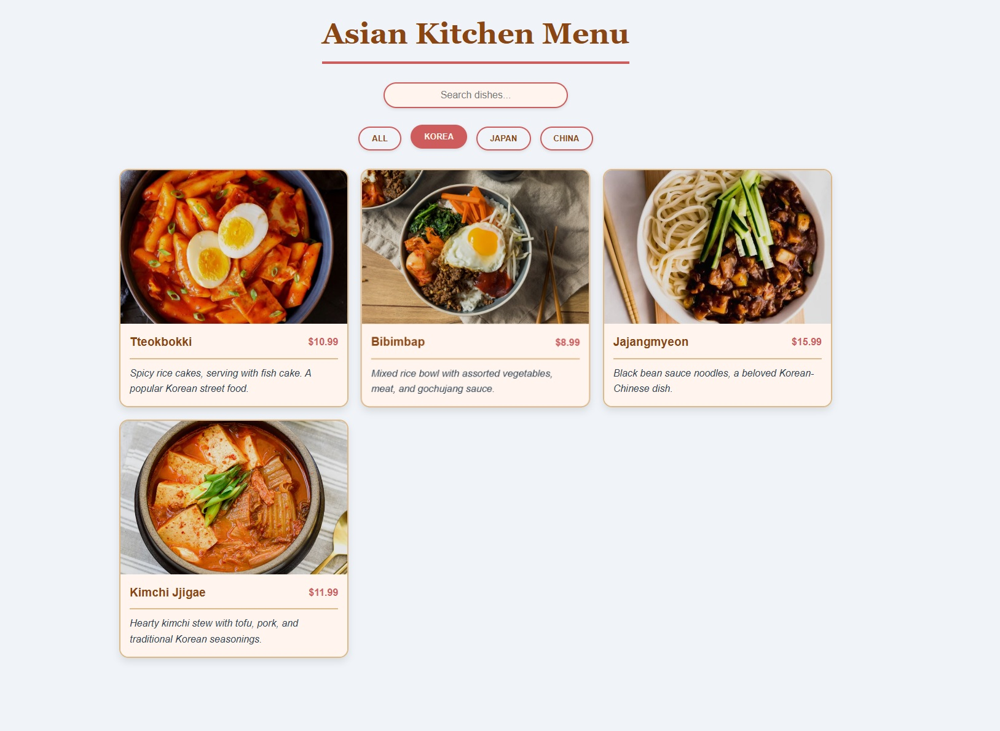

# Asian Kitchen Menu

## Project Description
An elegant and responsive Asian cuisine menu web application with category filtering and theme switching capabilities.

## Features
- 🍜 Filter dishes by cuisine (Korean, Japanese, Chinese)
- 🔍 Search functionality for dishes
- 🌓 Light/Dark theme support
- 💫 Smooth animations and transitions
- 📱 Fully responsive design

## Technologies Used
- HTML5
- CSS3
- JavaScript
- CSS Custom Properties
- Local Storage

## How to Run
1. Clone the repository
2. Open `index.html` in your browser
3. Start exploring delicious Asian dishes!

## Screenshots

## Contributing
1. Fork the project
2. Create your feature branch
3. Make your changes
4. Submit a Pull Request
